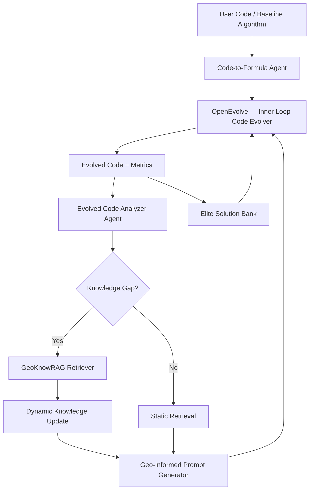

# 🌍 GeoEvolve — Implementation Plan
> **Based on:** *GeoEvolve: Automating Geospatial Model Discovery via Multi-Agent Large Language Models* (ICLR 2026, under review)

---

## 🧠 Project Overview

**GeoEvolve** is a multi-agent LLM framework that automates geospatial model discovery by combining:
- **Evolutionary code search** (via OpenEvolve / AlphaEvolve)
- **RAG-based geospatial domain knowledge** (GeoKnowRAG)
- **Multi-agent orchestration** (code evolver + code analyzer + prompt generator)

**Target Tasks:**
| Task | Baseline Model | Metric |
|---|---|---|
| Spatial Interpolation | Ordinary Kriging | RMSE ↓ |
| Spatial Uncertainty Quantification | GeoCP | Interval Score ↓ |
| Spatial Regression | GWR | R² ↑ |

---

## 🗺️ Architecture at a Glance



---

## 📦 Tech Stack

| Component | Tool/Library |
|---|---|
| Language | Python 3.10+ |
| LLM APIs | OpenAI (GPT-4o, GPT-4.1), Google Gemini 2.5, Qwen3 |
| Vector DB | ChromaDB |
| Embeddings | `text-embedding-3-large` / `gemini-embedding-001` |
| RAG Framework | Custom RAG-Fusion + RRF |
| Data Sources | arXiv API, Wikipedia API, GitHub API |
| Geospatial Libs | `pykrige`, `pyproj`, `geopandas`, `scikit-learn`, `mgwr` |
| Code Evolution | OpenEvolve (open-source AlphaEvolve) |
| Experiment Tracking | WandB or MLflow |
| Datasets | Australian Minerals, Seattle Housing, Georgia Census + 6 more |

---

## 🔢 Phases Overview

| Phase | Name | Duration |
|---|---|---|
| 1 | Foundation & Environment Setup | Week 1 |
| 2 | GeoKnowRAG — Knowledge System | Week 2–3 |
| 3 | Core Evolutionary Engine (OpenEvolve) | Week 3–4 |
| 4 | Multi-Agent Orchestration (Full GeoEvolve) | Week 5–6 |
| 5 | Experiments & Evaluation | Week 7–8 |
| 6 | Ablation Studies & Generalization | Week 9–10 |

---

## 🚀 Phase 1 — Foundation & Environment Setup
**Duration:** Week 1  
**Goal:** Set up the full project structure, dependencies, data, and LLM access.

### 1.1 Project Structure
```
geoevolve/
├── agents/
│   ├── code_to_formula.py        # Code-to-Formula Agent
│   ├── code_analyzer.py          # Evolved Code Analyzer
│   ├── prompt_generator.py       # Geo-Informed Prompt Generator
│   └── controller.py             # Outer-Loop Agentic Controller
├── evolver/
│   └── openevolve_wrapper.py     # Wrapper around OpenEvolve
├── knowledge/
│   ├── builder.py                # Automated Knowledge Base Construction
│   ├── updater.py                # Dynamic Knowledge Update
│   └── retriever.py              # GeoKnowRAG Retrieval (RAG-Fusion + RRF)
├── tasks/
│   ├── kriging/
│   │   ├── baseline.py           # Ordinary Kriging baseline
│   │   └── evaluator.py          # RMSE evaluator
│   ├── geocp/
│   │   ├── baseline.py           # GeoCP baseline
│   │   └── evaluator.py          # Interval Score evaluator
│   └── gwr/
│       ├── baseline.py           # GWR baseline
│       └── evaluator.py          # R² evaluator
├── data/
│   ├── australia_minerals/
│   ├── seattle_housing/
│   └── georgia_census/
├── configs/
│   └── llm_config.yaml           # LLM model configuration
├── results/
├── tests/
├── main.py                       # Entry point
└── requirements.txt
```

### 1.2 Dependencies to Install
```bash
pip install openai google-generativeai chromadb langchain
pip install pykrige geopandas pyproj scikit-learn xgboost mgwr
pip install arxiv wikipedia-api PyGithub
pip install pymupdf tiktoken tqdm wandb
```

### 1.3 Data Acquisition
- [ ] Download Australian Minerals dataset (Cu, Pb, Zn) — from Luo et al. 2025
- [ ] Download Seattle / King County Housing dataset from [GeoDa Lab](https://geodacenter.github.io/data-and-lab/KingCounty-HouseSales2015/)
- [ ] Download Georgia census data from `GWmodel` R package
- [ ] Download 6 generalization datasets (Ocean Chlorophyll, Temperature, US Life Expectancy, China PM2.5, NYC Income, Chicago Health)

### 1.4 LLM API Setup
- [ ] Set up OpenAI API key → GPT-4o (primary) + GPT-4.1 (secondary)
- [ ] Set up Google Gemini API key → Gemini-2.5-flash + Gemini-2.5-pro *(optional)*
- [ ] Set up Qwen API *(optional)*
- [ ] Verify rate limits and budget

### ✅ Phase 1 Deliverables
- [ ] Fully configured Python environment
- [ ] All 9 datasets downloaded and preprocessed (80/10/10 splits)
- [ ] LLM API connectivity verified
- [ ] Project scaffold with empty modules

---

## 🧠 Phase 2 — GeoKnowRAG: Knowledge System
**Duration:** Week 2–3  
**Goal:** Build the automated, dynamic geospatial knowledge retrieval system.

> [!IMPORTANT]
> This is the most unique contribution of GeoEvolve vs. plain OpenEvolve. Quality of RAG directly determines algorithm quality.

### 2.1 Automated Knowledge Base Construction Agent
**File:** `knowledge/builder.py`

**Steps:**
1. Accept user's baseline geospatial code as input
2. Use LLM to semantically analyze the code and extract **5 core keywords** (e.g., "kriging", "variogram", "spatial autocorrelation")
3. Query 3 sources with those keywords:
   - **arXiv** → up to 50 papers (via `arxiv` Python library)
   - **Wikipedia** → up to 50 articles (via `wikipedia-api`)
   - **GitHub** → up to 50 README/code snippets (via `PyGithub`)
4. Download up to **150 documents** total, normalize to UTF-8
5. Store in `data/knowledge_base/` folder

```python
# Pseudocode
class KnowledgeBaseBuilder:
    def __init__(self, llm_client, sources=["arxiv", "wikipedia", "github"]):
        ...
    def extract_keywords(self, code: str) -> list[str]:
        # Use LLM to get 5 keywords from code
        ...
    def fetch_documents(self, keywords: list[str]) -> list[Document]:
        # Fetch up to 150 docs from 3 sources
        ...
    def build(self, code: str) -> KnowledgeBase:
        keywords = self.extract_keywords(code)
        docs = self.fetch_documents(keywords)
        return KnowledgeBase(docs)
```

### 2.2 Text Chunking and Preprocessing
**File:** `knowledge/retriever.py`

- Chunk each document into **300-word chunks with 50-word overlap**
- Strip PDF formatting, HTML tags, Markdown, de-duplicate
- Tokenize to clean UTF-8 corpus

### 2.3 Vectorization & ChromaDB Indexing
- Embed every chunk with `text-embedding-3-large` (OpenAI)
- Store vectors in **ChromaDB** with metadata (source type, topic, URL)
- Support millisecond approximate nearest-neighbor search

### 2.4 RAG-Fusion Query Engine
**Core Algorithm:**
1. Take input query from GeoEvolve controller
2. Use LLM to **expand into 3–5 sub-questions** (theory / implementation / evaluation angles)
3. Embed each sub-question → vector search → top-k chunks each
4. **Reciprocal Rank Fusion (RRF)** across sub-query results
5. Aggregate highest-ranked chunks → summarize into **geo-informed prompt**

```python
def rag_fusion_query(query: str, k=5) -> str:
    sub_questions = llm_expand_query(query)     # Step 2
    all_results = [chroma_search(q, k) for q in sub_questions]  # Step 3
    fused = reciprocal_rank_fusion(all_results) # Step 4
    prompt = summarize_to_prompt(fused[:k])     # Step 5
    return prompt
```

### 2.5 Dynamic Knowledge Updater
**File:** `knowledge/updater.py`

- Triggered when code analyzer detects a **knowledge gap**
- Fetches **up to 5 new documents** per outer cycle from web
- Augments ChromaDB in real-time
- Reverts to static retrieval if knowledge is deemed sufficient

### ✅ Phase 2 Deliverables
- [ ] `KnowledgeBaseBuilder` — automated keyword extraction + doc fetching
- [ ] ChromaDB indexed with 150+ geospatial documents
- [ ] RAG-Fusion query engine returning ranked geo-informed prompts
- [ ] `KnowledgeUpdater` — dynamic document addition during evolution
- [ ] Unit tests for all retrieval components

---

## ⚙️ Phase 3 — Core Evolutionary Engine (OpenEvolve Wrapper)
**Duration:** Week 3–4  
**Goal:** Wrap OpenEvolve for geospatial tasks; implement Code-to-Formula agent.

### 3.1 Install & Configure OpenEvolve
```bash
pip install git+https://github.com/codelion/openevolve.git
```
- Configure for **10 inner-loop evolutionary iterations** per outer cycle
- Set primary model = GPT-4o, secondary/validator = GPT-4.1

### 3.2 Code-to-Formula Agent
**File:** `agents/code_to_formula.py`

**Purpose:** Converts a user's raw geospatial code into a standardized triplet format required by OpenEvolve, without requiring manual configuration.

**Triplet Format:**
```python
{
    "initial_program": "...",   # Core algorithm code
    "evaluator": "...",         # Evaluation function (RMSE, IS, R²)
    "prompt_template": "..."    # Instructions to LLM for mutations
}
```

**Steps:**
1. Use LLM semantic parser + few-shot examples (Kriging, GeoCP templates)
2. Extract core algorithmic logic from user code
3. Auto-generate evaluator wrapper
4. Output standardized triplet → feed to OpenEvolve

### 3.3 Baseline Algorithm Implementations
Implement the three classical baselines (clean, well-documented Python):

**Ordinary Kriging** (`tasks/kriging/baseline.py`):
- Using `pykrige.OrdinaryKriging`
- Variogram models: Exponential, Gaussian, Linear
- Cross-validation for parameter selection
- Evaluator: RMSE on test set

**GeoCP** (`tasks/geocp/baseline.py`):
- Conformal prediction with Gaussian spatial kernel
- Geographic bandwidth parameter
- Weighted quantile estimation
- Evaluator: Interval Score (IS)

**GWR** (`tasks/gwr/baseline.py`):
- Using `mgwr` library
- Geographic coordinate inputs
- Evaluator: R²

### 3.4 Elite Solution Bank
- After each inner loop, store top-k solutions
- Prevent performance regression by comparing against global elite
- Controller selects best elite as starting point for next outer cycle

### ✅ Phase 3 Deliverables
- [ ] OpenEvolve installed and running with a simple test case
- [ ] Code-to-Formula Agent converting all 3 baselines to triplet format
- [ ] All 3 baseline algorithms implemented and evaluated on datasets
- [ ] Elite solution bank logic implemented
- [ ] Verified: 10 inner-loop iterations run without errors

---

## 🤖 Phase 4 — Multi-Agent Orchestration (Full GeoEvolve)
**Duration:** Week 5–6  
**Goal:** Build the full outer-loop controller that ties all agents together.

### 4.1 Evolved Code Analyzer Agent
**File:** `agents/code_analyzer.py`

**Inputs:** Evolved code + performance metrics (RMSE / IS / R²)  
**Outputs:**
1. Identification of **missing or problematic domain knowledge**
2. **Search queries** for GeoKnowRAG retrieval

**LLM Prompt Template (from Figure 6 in paper):**
```
You are a geospatial algorithm expert. Analyze the following evolved code 
and its performance metrics. Identify:
1. What geospatial knowledge is missing or incorrectly applied?
2. What specific queries should retrieve relevant geospatial literature?

Code: {evolved_code}
Metrics: RMSE={rmse}, MAE={mae}, R²={r2}

Return: {"missing_knowledge": [...], "search_queries": [...]}
```

### 4.2 Geo-Informed Prompt Generator
**File:** `agents/prompt_generator.py`

**Inputs:** Retrieved knowledge chunks + evolved code + metrics  
**Outputs:** Structured prompt for the code evolver with 4 key elements:
1. **Algorithmic fixes** — how to revise the current algorithm
2. **New operators/parameters** — candidates for next mutation
3. **Geospatial knowledge** — theory, empirical conditions, expected outputs
4. **Token budget control** — max tokens to reduce hallucination

### 4.3 Outer-Loop Agentic Controller
**File:** `agents/controller.py`

**The full GeoEvolve loop (10 outer × 10 inner = 100 total iterations):**

```python
class GeoEvolveController:
    def run(self, baseline_code, dataset, max_outer=10, max_inner=10):
        # Initialize
        triplet = code_to_formula_agent.convert(baseline_code)
        knowledge_base = kb_builder.build(baseline_code)
        elite = None

        for outer in range(max_outer):
            # Inner loop: run OpenEvolve for max_inner steps
            evolved = openevolve.run(triplet, steps=max_inner)

            # Update elite solution
            if elite is None or evolved.score > elite.score:
                elite = evolved

            # Analyze evolved code
            analysis = code_analyzer.analyze(evolved.code, evolved.metrics)

            # Dynamic knowledge update (if gap detected)
            if analysis.has_knowledge_gap:
                knowledge_base.update(analysis.search_queries, max_docs=5)
                retrieval_mode = "dynamic"
            else:
                retrieval_mode = "static"

            # Retrieve geo-informed knowledge
            geo_knowledge = geoknowrag.query(
                analysis.search_queries, 
                mode=retrieval_mode
            )

            # Generate new prompt
            new_prompt = prompt_generator.generate(
                evolved.code, evolved.metrics, geo_knowledge
            )

            # Update triplet prompt for next outer cycle
            triplet.prompt_template = new_prompt

        return elite
```

### 4.4 Configuration System
**File:** `configs/llm_config.yaml`
```yaml
gpt:
  primary: gpt-4o
  secondary: gpt-4.1
  embedding: text-embedding-3-large
  controller: gpt-4.1

gemini:
  primary: gemini-2.5-flash
  secondary: gemini-2.5-pro
  embedding: gemini-embedding-001
  controller: gemini-2.5-flash

qwen:
  primary: qwen3-235B
  secondary: qwen3-32B
  embedding: qwen3-embedding-8B
  controller: qwen3-32B
```

### ✅ Phase 4 Deliverables
- [ ] Code Analyzer Agent (LLM-powered with prompt template)
- [ ] Geo-Informed Prompt Generator (4-element structured output)
- [ ] Full outer-loop controller with 10×10 iteration logic
- [ ] Dynamic vs Static RAG mode switching
- [ ] YAML-based multi-LLM configuration
- [ ] End-to-end integration test on Kriging task

---

## 🧪 Phase 5 — Experiments & Evaluation
**Duration:** Week 7–8  
**Goal:** Reproduce paper results across all 3 tasks and 9 datasets.

### 5.1 Experiment Setup
- Dataset split: **8:1:1** (train / validation / test)
- 10 outer cycles × 10 inner iterations = **100 evolutionary iterations**
- Primary LLM: GPT-4o (can swap to Gemini or Qwen)
- Log all runs with WandB or MLflow

### 5.2 Task 1: Spatial Interpolation (Kriging)
**Dataset:** Australian Minerals (Cu, Pb, Zn)

**Expected GeoEvolve Improvements:**
- Expanded variogram family (Exponential, Gaussian, Linear, Matérn) + AIC/BIC auto-selection
- Adaptive empirical variogram (quantile/Silverman binning)
- Robust multi-start fitting (L1 / WLS)
- **Localized Kriging** (K-NN with condition-number-aware diagonal adjustment)
- Adaptive log transform with data-driven offset

**Target Results:**
| | Cu | Pb | Zn |
|---|---|---|---|
| Original RMSE | 0.9139 | 0.6619 | 0.6294 |
| GeoEvolve RMSE | ~0.77 | ~0.52 | ~0.55 |
| Improvement | ~15% | ~21% | ~13% |

### 5.3 Task 2: Spatial Uncertainty Quantification (GeoCP)
**Dataset:** Seattle Housing Price (King County)

**Base Predictor:** XGBoost (R² ≈ 0.871, RMSE ≈ 7.36)

**Expected GeoEvolve Improvements:**
- Re-optimized Gaussian kernel bandwidth (multi-start global search)
- Simplified but robust stepwise weighted quantile estimator

**Target Results:**
| | Interval Score | Avg Interval Size |
|---|---|---|
| Original | 44.76 | 18.33 |
| GeoEvolve (Dynamic RAG) | **41.24** | **13.78** |

### 5.4 Task 3: Spatial Regression (GWR)
**Dataset:** Georgia Census Education Data

**Target:** 29.5% increase in R² (0.1564 → 0.3556)

### 5.5 Evaluation Metrics
```python
# Kriging
rmse = np.sqrt(mean_squared_error(y_true, y_pred))
mae = mean_absolute_error(y_true, y_pred)
r2 = r2_score(y_true, y_pred)

# GeoCP  
interval_score = compute_interval_score(y_true, lower, upper, alpha=0.1)
avg_interval_size = np.mean(upper - lower)

# GWR
r2 = r2_score(y_true, y_pred)
```

### ✅ Phase 5 Deliverables
- [ ] Kriging experiment: RMSE results for Cu, Pb, Zn
- [ ] GeoCP experiment: Interval Score and Avg Interval Size
- [ ] GWR experiment: R² results
- [ ] Results tables matching (or improving on) paper benchmarks
- [ ] Spatial distribution maps / error distribution plots (like Figure 4, 5 in paper)

---

## 🔬 Phase 6 — Ablation Studies & Generalization
**Duration:** Week 9–10  
**Goal:** Validate design decisions through ablations and test generalizability.

### 6.1 Ablation Variants to Implement
| Variant | Description |
|---|---|
| **GeoEvolve (Dynamic RAG)** | Full system — dynamic knowledge updates |
| **GeoEvolve (Static RAG)** | Fixed knowledge base, no dynamic updates |
| **GeoEvolve (No RAG)** | No GeoKnowRAG at all |
| **OpenEvolve (No GeoKnowledge)** | Baseline OpenEvolve, no domain knowledge |
| **OpenEvolve (General GeoKnowledge)** | OpenEvolve + generic geo prompt |
| **OpenEvolve (Specific GeoKnowledge)** | OpenEvolve + task-specific geo prompt |

### 6.2 Multi-LLM Testing
Run GeoEvolve across 3 LLM families (Table 3 from paper):
- GPT: GPT-4o + GPT-4.1
- Gemini: Gemini-2.5-flash + Gemini-2.5-pro
- Qwen: Qwen3-235B + Qwen3-32B

### 6.3 Generalization Experiments
Test evolved algorithms on **out-of-distribution datasets**:

**Domain Generalization:**
- Evolve on source domain → test on different domain (e.g., housing prices → minerals)

**Spatial Generalization:**
- Test across different geographic regions (Australia, USA, China)

**Temporal Generalization:**
- Test on different time periods (temperature data, PM2.5)

**9 Datasets for Full Generalization Testing:**
| Task | Dataset |
|---|---|
| Kriging | Australian Minerals, Ocean Chlorophyll, Temperature (LA) |
| GeoCP | Seattle Housing, US Life Expectancy, China PM2.5 |
| GWR | Georgia Education, NYC Income, Chicago Health |

### 6.4 Runtime Analysis
Record and compare runtimes (expected from paper):
| Variant | Kriging | GeoCP | GWR |
|---|---|---|---|
| GeoEvolve (Dynamic RAG) | ~0.86h | ~1.26h | ~0.52h |
| GeoEvolve (Static RAG) | ~0.76h | ~1.32h | ~0.68h |
| GeoEvolve (No RAG) | ~0.57h | ~0.62h | ~0.50h |
| OpenEvolve | ~0.33h | ~0.15h | ~0.10h |

### ✅ Phase 6 Deliverables
- [ ] All 6 ablation variants implemented and evaluated
- [ ] Multi-LLM comparison table
- [ ] Domain / Spatial / Temporal generalization tables
- [ ] Runtime comparison table
- [ ] Final analysis: "Why does Dynamic RAG outperform Static RAG?"

---

## 📋 Overall Timeline Summary

```
Week 1:   Phase 1 — Environment, data, project scaffold
Week 2:   Phase 2 — Knowledge base builder + document fetching
Week 3:   Phase 2 + 3 — ChromaDB + RAG-Fusion + OpenEvolve setup
Week 4:   Phase 3 — Baselines, Code-to-Formula Agent, inner loop
Week 5:   Phase 4 — Code Analyzer, Prompt Generator
Week 6:   Phase 4 — Full controller, end-to-end integration
Week 7:   Phase 5 — Kriging + GeoCP experiments
Week 8:   Phase 5 — GWR experiment + result visualization
Week 9:   Phase 6 — Ablation studies
Week 10:  Phase 6 — Multi-LLM + generalization + runtime analysis
```

---

## ⚠️ Key Risks & Mitigation

| Risk | Mitigation |
|---|---|
| LLM API costs for 100 iterations | Start with 3 outer × 3 inner to validate, then scale |
| arXiv/GitHub rate limits | Add retry logic + caching to knowledge fetcher |
| OpenEvolve compatibility | Use pinned version from `codelion/openevolve` GitHub |
| Kriging divergence (like OpenEvolve on Chlorophyll) | Elite bank prevents regression; test stability early |
| ChromaDB persistence issues on Windows | Use persistent client with absolute path |

---

## 🔑 Key Design Insights from the Paper

> [!NOTE]
> **Dynamic RAG > Static RAG > No RAG** for most tasks — the ability to fetch NEW knowledge during evolution is what makes GeoEvolve unique.

> [!TIP]
> Start with the **Kriging task** — it's the most well-studied, has clear baseline metrics, and the paper's results are most reproducible.

> [!WARNING]
> OpenEvolve with "Specific GeoKnowledge" **catastrophically fails** on Ocean Chlorophyll (RMSE = 460). Static knowledge injection without dynamic adaptation can backfire. Always implement the dynamic updater.

> [!IMPORTANT]
> The **Code-to-Formula Agent** is critical for usability — without it, users must manually configure OpenEvolve's triplet format, which is error-prone for geospatial researchers.
